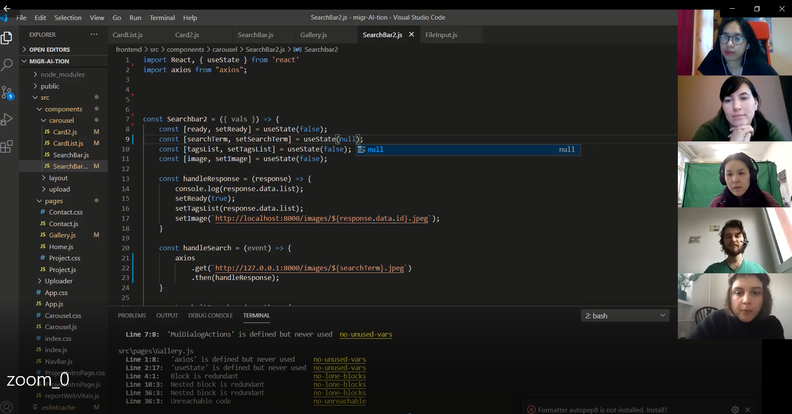
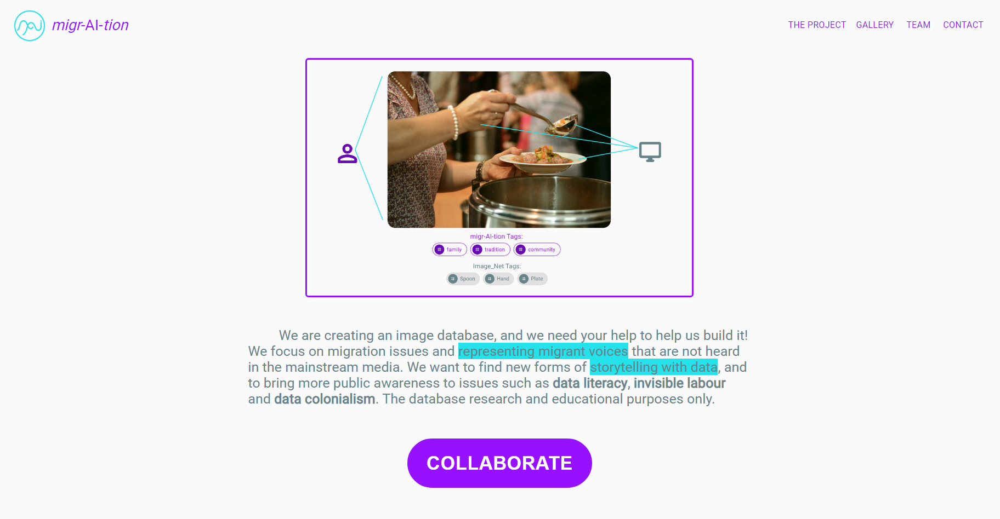

# migr-AI-tion

## Abstract
Social inequalities are being reinforced and propagated by the economic operations of the tech industry, specifically in the ways that data is scraped and trained for AI technologies. The blind trust that is placed in software to provide "objective" judgements creates problematic divisions between those who can shape knowledge, and those who are tracked, silenced, and exploited to develop technologies for First World users. This problem, data colonialism, recalls a European colonial tradition, wherein a scientific, 'objectivist' rationale was provided for the colonization of 'other' groups. To address data colonialism, we decided to implement a data literacy project, to educate users on how "truth" is created using data, and to provide new possibilities for self-representation for migrants, whose stories are not heard in the mainstream media. For this project, we decided to focus on how experiences of migrants could be incorporated into a computer vision dataset. 

## Background Information
Artificial Intelligence has become a sort of catch-all, ubiquitous term. Buzzwords like "neural nets", "reinforcement learning" or "deep learning",  creates a landscape of imagination that ranges from futuristic androids that might help the elderly population out of bed, as well as, dystopian futures framed by Cambridge Analytica 2.0. Computer Vision technologies are created by tracing and tagging images for technologies such as self-driving cars. However, most people don't know the dark side that the labour for tracing and tagging is taken from places such as refugee work camps. Furthermore, image recognition technologies are often used for the surveillance and tracking of migrants. 

According to The International Organization of Migration’s World Migration Report 2020, there are almost 272 million international migrants globally, of whom 164 million are migrant workers. There are 70.8 million forced migrants, of whom 25.9 million are refugees, and 41.3 million are internally displaced peoples. It states, “As artificial intelligence is progressively taken up in key sectors, its consequences for migrant worker flows and domestic labour markets are areas of intense focus for policymakers and businesses in origin and receiving countries”. Anduril Industries is the the AI surveillance technology deployed at the Mexican border, created by Oculus founder, Palmer Luckey. Azure Government is currently being used at Immigration and Custom’s enforcement “to process data on edge devices or utilize deep learning capabilities to accelerate facial recognition and identification”. Microsoft also has a $19.4 million contract with American Immigration and Customs Enforcement for a facial recognition and data processing AI. In February of 2020, Eyal Weizmann was barred from entering America when he arrived to attend the opening of an exhibition, due to having triggered an algorithm at borders control.

Intersecting with the issue of migration, AI was shown to have systemic biases towards people of color, as seen by Amazon’s Rekognition, which was marketed heavily to police. ACLU found that it falsely matched 28 members of Congress with mugshots. The false matches were disproportionately people of color. Another intersecting issue is gender: most female migrants are overqualified for their work, calling for a need to address migration issues from the perspective of gender inclusion. Here too, software such as Predictum scans the photographs of applicants’ social media profile in order to determine their “trustworthiness” for baby-sitting jobs, allowing employers to surveil the social lives low-wage job applicants.

The intersections of technology and global inequality are overwhelmingly complex. We wanted to create a simple app to begin tackling some these issues. 

## Features
Computer vision is a wide field, but one of the classic, first achievements of computer vision was the classification of objects present in images. This particular task is also known for its bias, a subgroup of classification algorithms can detect faces, but are significantly less efficient with people of color. While some of these biases have been addressed, there remain fundamental problems with computer vision. Firstly, it often continues to show a bias in favor of the Global North.  Secondly, people often misconceive how effective AI actually is at detecting and recognizing. We needed to bring more public understanding to the magical, "black box" AI. To do this, we implemented 3 features:

1. **Image upload** - The image upload features allows users to upload an image and to tag and create a caption for that image. Once the data has been submitted, users are able to compare their tags with ImageNet AI tags.

2. **Image view -** The image view feature allows users to search for images via 'tags' of their interest. Viewers are able to view all images related to a certain tag on a sliding carousel, and all tags assigned to a particular image. ImageNet AI tags are again available for making comparisons.

3. **Data visualisation -** On the home page, users are able to see the network relations of tags and the frequency by which a certain tag has been submitted. This gives the user a general idea of what aspects of the migration experience are considered important by migrants themselves. 

## Other

1. **Contact form -** enables users to contact admin, about potential questions, interests or problems, including flagging. 
2. **About Page -** brief descriptions and contacts of the team

## Methods

In order to implement a rudimentary prototype in short period of time, we followed routine of Monday evening SCRUM meetings, weekly track and inter-track meetings. Project organization and communications were held via Notion, Slack and Zoom. 

We decided to create a platform with three central features to help users understand image tagging and network relations. The general tools for each track were as follows:

*UX:* Typeform and emails for User Research, Figma for design

*WEB:* front-end; UX designs were implemented by the Web track using React.js. Components were created with a combination of Material-UI templates, React wrappers, and CSS styles sent by the UX track via Figma. 

*DATA:* back-end; the components of the backend were created in Python, the data bases were created in SQLite, FastAPI was used for the APIs, and the deployment was executed in AWS. 

## Challenges

### 1. Creating a simple solution for a complex and hard-to-understand problem

The first challenge is to demystify AI into something understandable for the everyday user. We had to think of solutions to deal with complex terms to reach every possible user. The notion of "bias" is hard to show, especially the subtleness of bias in AI, whose logics are usually hidden from the public. The solution we came up with was to create multiple forms of comparisons between user tags and ImageNet AI tags, and images with the same tags by different users. We tried to create a user experience to show the shortcomings of current image classification in a direct and personalized way. However, in order to enlist users, we had to come up with concrete examples of the positive impact that our platform will generate. 

### 2. Defining an MVP (for promoting data literacy in AI)

From the onset to the end of the project phase, our MVP sifted through several iterations, as we figured out the most direct course of action. In the beginning, we wanted to integrate an annotation tool, to give the user an experience of using an annotation interface. However, the idea turned out to be too complicated for the the amount of time we had, especially given that there is plenty of data available in just creating tags and captions for a whole image. The idea to create a direct comparison to ImageNet tags came at the very end, after creating basic upload and view features. A slide presentation to explain to introduce the project concept also came at the end.

### 3. Designing a user-friendly and informative UI

We wanted to implement a neat UI, while distancing ourselves from corporate design, as we are taking a difference stance than corporations on issues of data. The upload process, being the most important, had to be simple and clear, letting the user know our expectations while giving them immediate results and feedback. Uploading images is always a hassle, why should users even do it?  In the beginning, we were designing an app for a desktop browser only, however, after considering that most people store their images on their phone, we used Material-UI to implement desktop and mobile designs simultaneously. 

## Results

We were able to achieve the intended minimum viable product. The design and implementation of this prototype will serve as the foundation for thinking about datasets on more ethical and collaborative terms and to create more public awareness of how AI training sets are made. All code of this project are published under Open Source License, and the second iteration of migr-AI-tion will be implemented with Prototype Fund (Round 9). Besides evolving technical features, the next phase of the project will focus on working with protagonists for an art-documentary project working with data. There will be more emphasis on research, understanding user needs and concerns around data, automation, and collaboration, and interpreting research results.